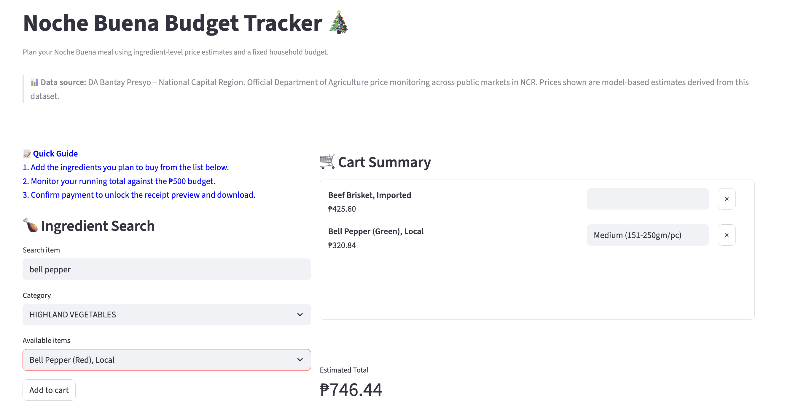
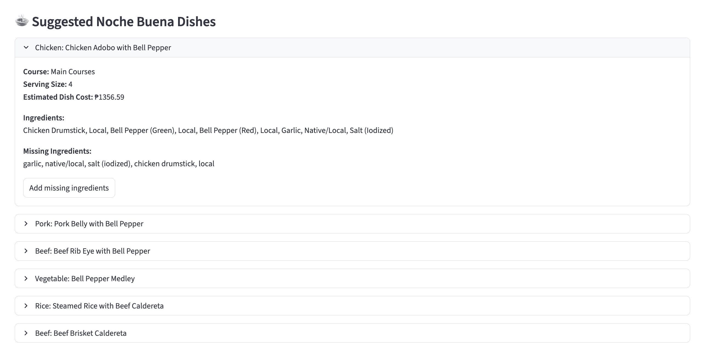
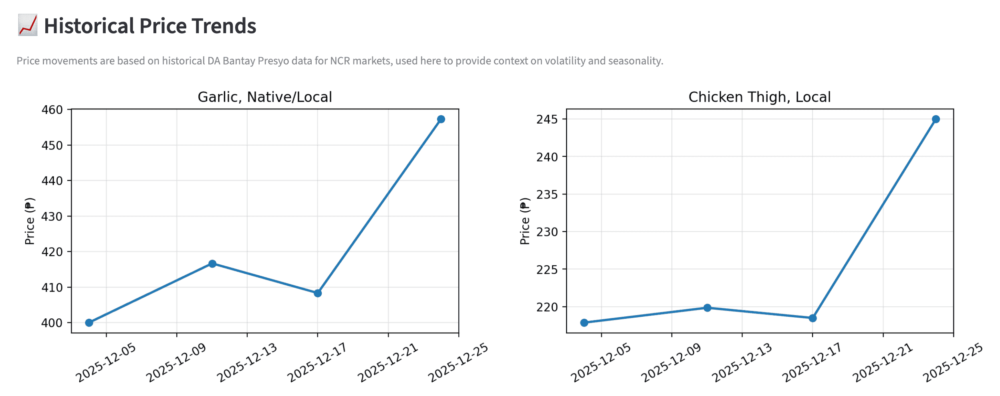

# Nochebuena Budget Tracker

An end-to-end data engineering and machine learning pipeline that extracts, cleans, and loads food price data, predicts Christmas Eve prices, and supports interactive meal budgeting through a Streamlit dashboard.



---

## About the Project

This project automates extraction of weekly food price data from OCR-processed PDFs published by the Philippine Department of Agriculture’s Bantay Presyo program. It cleans and loads this data into a PostgreSQL database, predicts Christmas Eve prices with a holiday markup, and enables users to plan affordable Noche Buena meals within a ₱500 budget using an interactive Streamlit app.

---

## Tools & Technologies Used

- **Python** (pandas, psycopg2, scikit-learn) for ETL and ML  
- **PostgreSQL** (via Docker) as the data warehouse  
- **SQL** for schema definition and upsert queries  
- **Machine Learning** for price prediction and budget classification  
- **Streamlit** for the budgeting and meal planning dashboard  

---

## Concepts Demonstrated

- ETL pipeline: extraction, cleaning, and loading of OCR PDF data  
- Holiday price forecasting with markup adjustments  
- Meal suggestion and budget optimization  
- Interactive visualizations and dynamic budgeting UI 

---

## Architecture Diagram

```mermaid
flowchart LR

    %% ===== STYLES (HIGH CONTRAST) =====
    classDef process fill:#1E3A8A,color:#FFFFFF,stroke:#000000,stroke-width:2px;
    classDef data fill:#065F46,color:#FFFFFF,stroke:#000000,stroke-width:2px;
    classDef storage fill:#7C2D12,color:#FFFFFF,stroke:#000000,stroke-width:2px;
    classDef output fill:#831843,color:#FFFFFF,stroke:#000000,stroke-width:2px;

    %% ===== INPUT =====
    A[Raw Bantay Presyo PDF Files]:::data

    %% ===== ETL =====
    B[Extract Prices extract_pdf.py]:::process
    C[Clean and Normalize Prices clean_prices.py]:::process
    D[Load to Database load_db.py]:::process

    %% ===== DATABASE =====
    DB[(PostgreSQL Price Database)]:::storage

    %% ===== ANALYTICS =====
    E[Train Price Prediction Model train_price_model.py]:::process
    F[Predicted Weekly Prices CSV]:::data
    G[Noche Buena Meal Optimizer meal_optimizer.py]:::process
    H[Optimized Menu JSON]:::data

    %% ===== DASHBOARD =====
    I[Interactive Streamlit Dashboard app.py]:::process
    J[Generated Receipt and Budget Summary]:::output

    %% ===== FLOW =====
    A --> B --> C --> D --> DB
    DB --> E --> F
    F --> G --> H
    DB --> I
    F --> I
    H --> I
    I --> J
````

---

## How to Use the Streamlit Dashboard



* Search and add predicted price items to your cart
* Track your total against a ₱500 budget with warnings
* Download a PDF receipt of your selected items
* Receive meal suggestions based on your cart ingredients
* View historical price trends of selected items




### Here’s the Streamlit demo: https://nochebuena-budget-tracker.streamlit.app/?embed_options=light_theme,show_footer

---

## Next Steps / Recommendations

* Automate data extraction for continuous updates
* Incorporate more comprehensive price data sources (Use pricrs from groceries online)
* Improve ML models for risk and anomaly detection
* Enhance dashboard UI with export and alert features
* Deploy on cloud platforms for scalability
```
```
